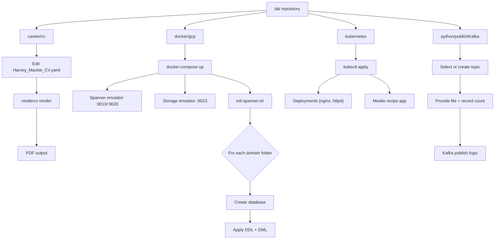

# lab


## Overview

Learning new infrastructure tooling in isolation is slow when there is no runnable reference to experiment against. This repository collects hands-on mini-projects and configuration snippets that can be spun up locally to explore Docker, Kubernetes, GCP emulation, Kafka publishing, and CV generation via code. It is aimed at software engineers who want a single place to revisit working examples rather than rebuilding boilerplate from scratch each time.

## Getting Started

### Prerequisites

- [Docker](https://docs.docker.com/get-docker/) and [Docker Compose](https://docs.docker.com/compose/install/) — for GCP emulation
- [kubectl](https://kubernetes.io/docs/tasks/tools/) — for Kubernetes manifests
- [Python 3](https://www.python.org/downloads/) and [pipx](https://pipx.pypa.io/stable/) — for the CV generator and Kafka publisher
- [rendercv](https://github.com/sinaatalay/rendercv) — for CV PDF generation (`pip install rendercv`)

### Installation

Clone the repository and install dependencies for the area you want to work with.

**CV generator (career/cv):**

```sh
$ cd career/cv
$ python3 -m venv venv
$ source venv/bin/activate
$ pip3 install -r requirements.txt
// Successfully installed rendercv-...
```

**GCP local emulator (docker/gcp):**

```sh
$ cd docker/gcp
$ docker-compose up -d
// [+] Running 3/3
//  ✔ Container spanner-emulator   Started
//  ✔ Container storage-emulator   Started
//  ✔ Container spanner-init       Started
```

### Usage

**Render the CV to PDF:**

```sh
$ rendercv render Harvey_Mackie_CV.yaml
// CV rendered to rendercv_output/Harvey_Mackie_CV.pdf
```

**Publish Kafka messages interactively:**

```sh
$ python3 python/publishKafka/publishKafka.py
// Welcome to Kafka Publisher
// Current topics:
// 1. CPP-REQUEST
// Enter a topic (or new one if not listed):
```

**Apply a Kubernetes deployment:**

```sh
$ kubectl apply -f kubernetes/deployments/deploy.yaml
// deployment.apps/frontenddeployment created
```

**Fix Rancher Docker CLI symlinks:**

```sh
$ bash kubernetes/shell/fixRancherLinks.sh
// Symlinks updated successfully!
```

## Structure

```sh
lab/
├── career/
│   └── cv/                          # CV-as-code using rendercv
│       ├── Harvey_Mackie_CV.yaml    # CV source data (edit this)
│       ├── requirements.txt         # Python dependencies (rendercv)
│       └── rendercv_output/         # Generated PDF output
├── docker/
│   └── gcp/                         # Local GCP emulator stack
│       ├── docker-compose.yml       # Spanner + Storage emulator services
│       ├── scripts/
│       │   └── init-spanner.sh      # Initialises Spanner instance & databases
│       └── 0__lower_setup/          # Domain-specific SQL scripts
│           ├── school/              # school database DDL + DML
│           └── zenzone/             # zenzone database DDL + DML
├── kubernetes/
│   ├── deployments/                 # Generic deployment manifests (nginx, httpd)
│   ├── mealie/                      # Mealie recipe app K8s manifests
│   └── shell/
│       └── fixRancherLinks.sh       # Repair Docker CLI plugin symlinks
└── python/
    └── publishKafka/                # Interactive Kafka topic publisher
        ├── publishKafka.py          # Main script
        └── topics.json              # Persisted list of known topics
```

## How It Works



## References

- [rendercv — CV-as-code tool](https://github.com/sinaatalay/rendercv)
- [Google Cloud Spanner Emulator](https://cloud.google.com/spanner/docs/emulator)
- [GCP Storage Emulator (oittaa)](https://github.com/oittaa/gcp-storage-emulator)
- [Mealie — self-hosted recipe manager](https://github.com/mealie-recipes/mealie)
- [Apache Kafka documentation](https://kafka.apache.org/documentation/)
